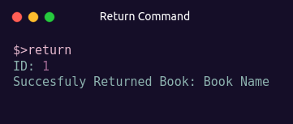

<h3>A basic console-based library management system</h3>

[Preview](https://github.com/cMardc/Library_Management/assets/130239955/fb555209-a8ac-41e5-b7e8-fddcac66a0c1)

<h2>Build and run</h2>

<h2>How to use</h2>

<h3>Add</h3>
<h4>Adds a book to list. Takes 8 arguments: title, author, genre, publisher, ID, ISBN, release date, page count.</h4>
 

<h3>Delete</h3>
<h4>Deletes a book from list. Takes 1 argument: ID.</h4>
 

<h3>Show</h3>
<h4>Shows all books in list. Does not take any arguments.</h4>
 

<h3>View</h3>
<h4>Searchs and shows spesific books. Takes 1 argument: keyword.</h4>
 

<h3>Borrow</h3>
<h4>Borrows a book. Takes 1 argumnet: ID.</h4>
 

<h3>Return</h3>
<h4>Returns a book. Takes 1 argument: ID.</h4>
 

